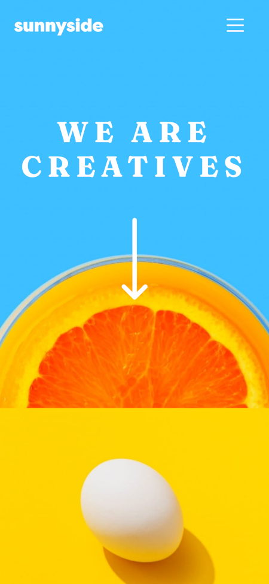
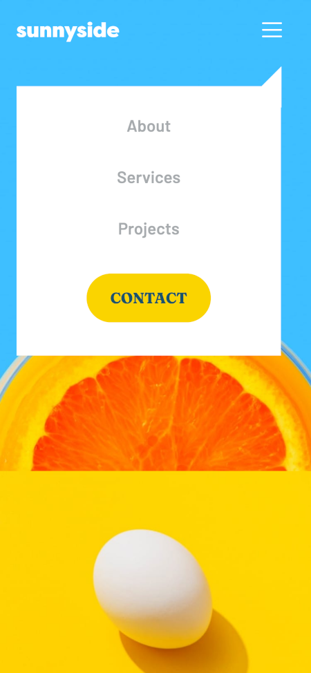

# Frontend Mentor - Sunnyside agency landing page solution

This is a solution to the [Sunnyside agency landing page challenge on Frontend Mentor](https://www.frontendmentor.io/challenges/sunnyside-agency-landing-page-7yVs3B6ef). Frontend Mentor challenges help you improve your coding skills by building realistic projects.

## Table of contents

- [Frontend Mentor - Sunnyside agency landing page solution](#frontend-mentor---sunnyside-agency-landing-page-solution)
  - [Table of contents](#table-of-contents)
  - [Overview](#overview)
    - [The challenge](#the-challenge)
    - [Screenshot](#screenshot)
    - [Links](#links)
  - [My process](#my-process)
    - [Built with](#built-with)
    - [What I learned](#what-i-learned)
    - [Continued development](#continued-development)
    - [Useful resources](#useful-resources)
  - [Author](#author)


## Overview

### The challenge

Users should be able to:

- View the optimal layout for the site depending on their device's screen size
- See hover states for all interactive elements on the page

### Screenshot




Add a screenshot of your solution. The easiest way to do this is to use Firefox to view your project, right-click the page and select "Take a Screenshot". You can choose either a full-height screenshot or a cropped one based on how long the page is. If it's very long, it might be best to crop it.

Alternatively, you can use a tool like [FireShot](https://getfireshot.com/) to take the screenshot. FireShot has a free option, so you don't need to purchase it.

Then crop/optimize/edit your image however you like, add it to your project, and update the file path in the image above.

**Note: Delete this note and the paragraphs above when you add your screenshot. If you prefer not to add a screenshot, feel free to remove this entire section.**

### Links

- Solution URL: [Add solution URL here](https://your-solution-url.com)
- Live Site URL: [Add live site URL here](https://your-live-site-url.com)


## My process


### Built with

- Semantic HTML5 markup
- Bootstrap 5
- CSS custom properties
- Flexbox
- CSS Grid
- Mobile-first workflow
- Visual Studio Code
- Firefox Developer Edition


### What I learned

I wanted to use this project as a refresher for my HTML and CSS knowledge. I also needed to practice specificity for my CSS and general speed at putting a front-end project together.


One of the things I wasn't sure about was how to get the multi-colored bars under the 'Learn More' links. After a bit of tweaking, I decided to go with a horizontal rule element and style it appropriately. In an effort to follow the principles of D.R.Y., I tried to add all like styles to one class and ended up with only a color difference between the two elements.

```css
.learn .learn-hr {
    height: 10px;
    width: 140px;
    border-radius: 20px;
    margin: -8px auto 0 auto;
}

.learn .yellow-learn {
    background-color: var(--yellow);
}

.learn .red-learn {
    background-color: var(--softRed);
}
```


Another issue that really held me up was the small triangle flair on the mobile menu. After referencing [https://www.css-tricks.com](https://www.csstricks.com), I was able to draw a simple triangle using transparent values on a border. 

It did open my eyes to trend towards simplifying my solutions, as I was going to attempt drawing one with path().


```css
#mobile-menu-flair {
    position: absolute;
    margin-top: 1.5rem;
    margin-left: 78.5vw;
    border-right: 25px solid var(--white);
    border-bottom: 25px solid transparent;
    border-top: 25px solid transparent;
}
```

### Continued development

Use this section to outline areas that you want to continue focusing on in future projects. These could be concepts you're still not completely comfortable with or techniques you found useful that you want to refine and perfect.

**Note: Delete this note and the content within this section and replace with your own plans for continued development.**

### Useful resources

- [Example resource 1](https://www.example.com) - This helped me for XYZ reason. I really liked this pattern and will use it going forward.
- [Example resource 2](https://www.example.com) - This is an amazing article which helped me finally understand XYZ. I'd recommend it to anyone still learning this concept.

**Note: Delete this note and replace the list above with resources that helped you during the challenge. These could come in handy for anyone viewing your solution or for yourself when you look back on this project in the future.**

## Author

- Website - [Ashley Yearicks](https://yearicks.dev)
- Twitter - [@jessarin5](https://www.twitter.com/jessarin5)
