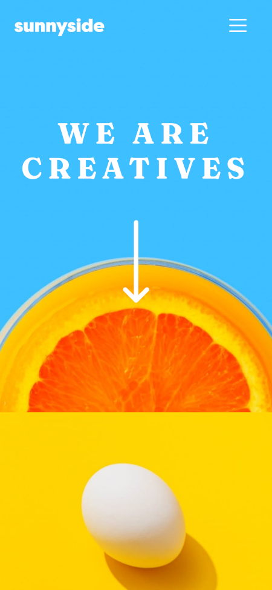
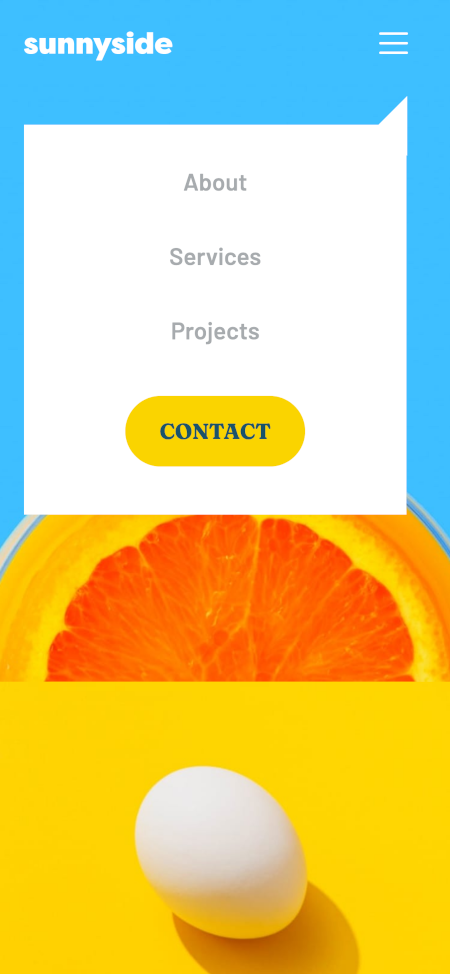
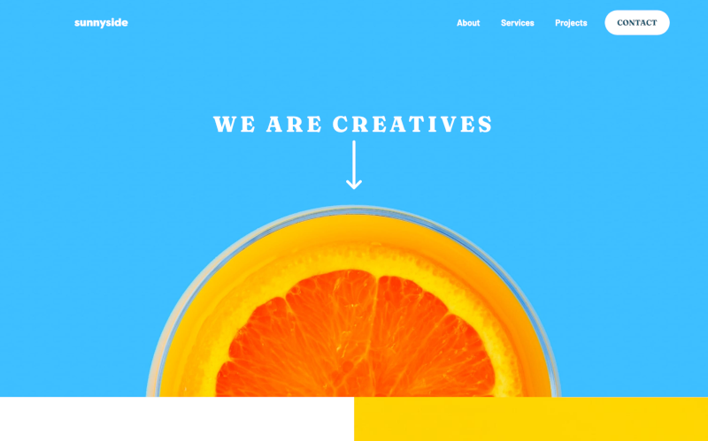
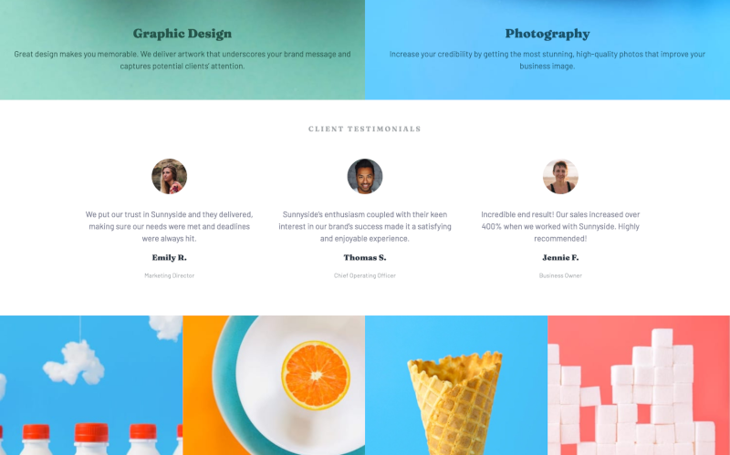

# Frontend Mentor - Sunnyside agency landing page solution

This is a solution to the [Sunnyside agency landing page challenge on Frontend Mentor](https://www.frontendmentor.io/challenges/sunnyside-agency-landing-page-7yVs3B6ef). Frontend Mentor challenges help you improve your coding skills by building realistic projects.

## Table of contents

- [Frontend Mentor - Sunnyside agency landing page solution](#frontend-mentor---sunnyside-agency-landing-page-solution)
  - [Table of contents](#table-of-contents)
  - [Overview](#overview)
    - [The challenge](#the-challenge)
    - [Screenshot](#screenshot)
    - [Links](#links)
  - [My process](#my-process)
    - [Built with](#built-with)
    - [What I learned](#what-i-learned)
    - [Useful resources](#useful-resources)
  - [Author](#author)


## Overview

### The challenge

Users should be able to:

- View the optimal layout for the site depending on their device's screen size
- See hover states for all interactive elements on the page

### Screenshot







### Links

- Solution URL: [Github Repo](https://github.com/ayearicks/sunnyside-agency-landing-page-main)
- Live Site URL: [Live Site](https://yearicks.dev/sunnyside-agency)


## My process


### Built with

- Semantic HTML5 markup
- Bootstrap 5
- CSS custom properties
- Flexbox
- Mobile-first workflow
- Visual Studio Code
- Firefox Developer Edition


### What I learned

I wanted to use this project as a refresher for my HTML and CSS knowledge. I also needed to practice specificity for my CSS and general speed at putting a front-end project together.


One of the things I wasn't sure about was how to get the multi-colored bars under the 'Learn More' links. After a bit of tweaking, I decided to go with a horizontal rule element and style it appropriately. In an effort to follow the principles of D.R.Y., I tried to add all like styles to one class and ended up with only a color difference between the two elements.

```css
.learn .learn-hr {
    height: 10px;
    width: 140px;
    border-radius: 20px;
    margin: -8px auto 0 auto;
}

.learn .yellow-learn {
    background-color: var(--yellow);
}

.learn .red-learn {
    background-color: var(--softRed);
}
```


Another issue that really held me up was the small triangle flair on the mobile menu. After referencing [https://www.css-tricks.com](https://www.csstricks.com), I was able to draw a simple triangle using transparent values on a border. 

It did open my eyes to trend towards simplifying my solutions, as I was going to attempt using margin-left and margin-right, which would have introduced responsive errors on multiple viewports.


```css
#mobile-menu-flair {
    position: absolute;
    top: 100%;
    right: 5%;
    border-right: 25px solid var(--white);
    border-bottom: 25px solid transparent;
    border-top: 25px solid transparent;
}
```


### Useful resources

- [Bootstrap v5 Documentation](https://getbootstrap.com/docs/5.0/getting-started/introduction/) - This is the first project that I've created using Bootstrap v5.0, so these docs were very helpful in finding the changes between v5.0 and v4.6.
- [Impressive Webs](https://www.impressivewebs.com/understanding-em-units-css/) - This whole write up definitely helped me understand the difference, and when to use ems and rems. Highly recommend!


## Author

- Website - [Ashley Yearicks](https://yearicks.dev)
- Twitter - [@jessarin5](https://www.twitter.com/jessarin5)
